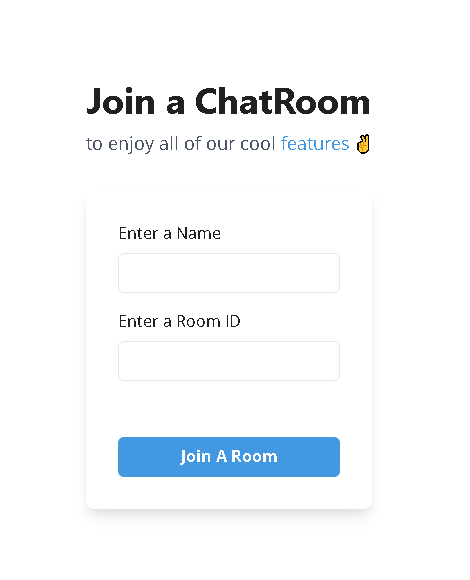
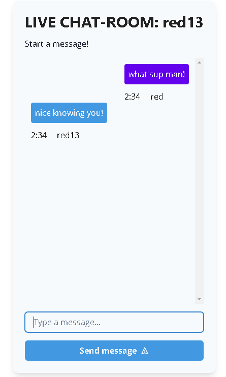
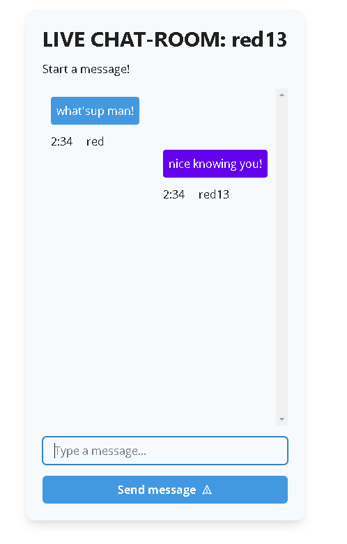

# Simple React Chat App

This repository contains a simple React chat application that allows users to communicate in real-time.

## Project Structure

The project structure is as follows:

- `src/` - The source code directory.
  - `App.js` - The main component that renders the chat app.
  - `index.js` - The entry point of the application.
- `public/` - Contains the public assets and HTML template for the app.
- `README.md` - Provides information about the chat app and instructions for usage.
- `LICENSE` - The license file for the repository.

## Usage

To use this repository and run the chat app locally, follow these steps:

1. Clone the repository to your local machine.
2. Open a terminal and navigate to the project directory.
3. Install the dependencies by running the command `npm install`.
4. Start the development server with the command `npm run start`.
5. Open your web browser and visit `http://localhost:3000` to access the chat app.
6. You can now use the chat app to send and receive messages in real-time.

## Features

The simple React chat app includes the following features:

- Real-time messaging: Users can send and receive messages instantly.
- User identification: Each user is assigned a unique identifier to distinguish their messages.
- Message timestamps: Messages are displayed with timestamps indicating when they were sent.
- Basic UI: The app provides a clean and minimalistic user interface for an intuitive experience.

## Image

Here are some screenshots of the chat app in action:

### Screenshot 1: Main Chat Interface

The main chat interface displays the conversation between users, along with their avatars and timestamps.

### Screenshot 2: Sending Messages

Users can easily send messages by typing in the input field and hitting the enter key.

### Screenshot 3: User Notifications

## License

This repository is licensed under the [MIT License](LICENSE).